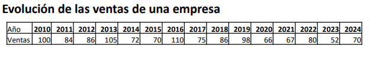
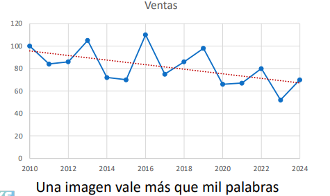
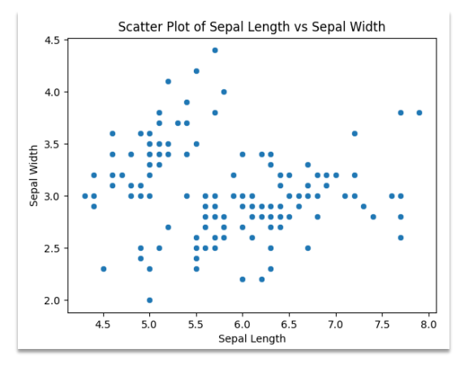
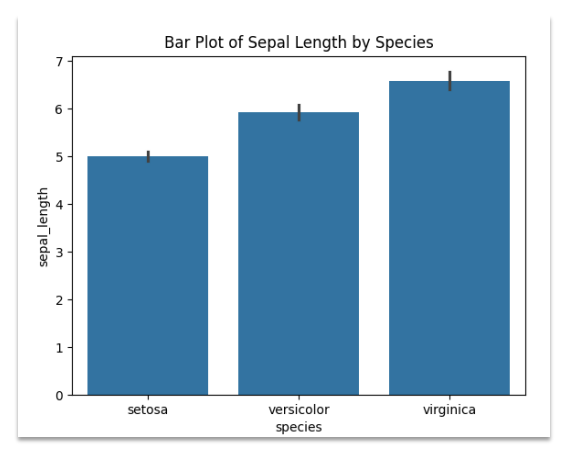
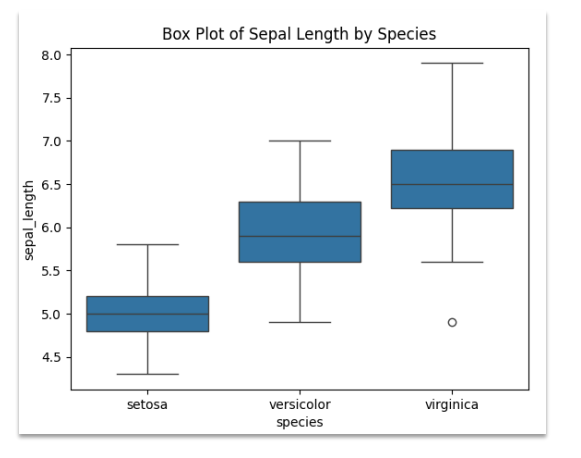
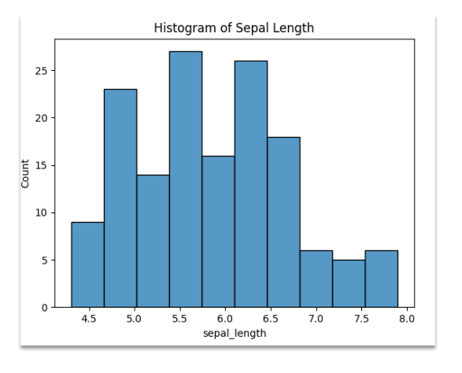
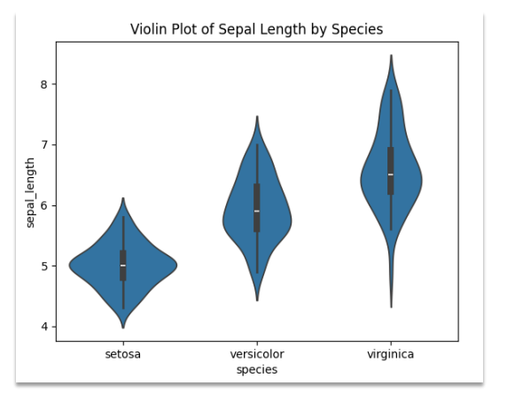
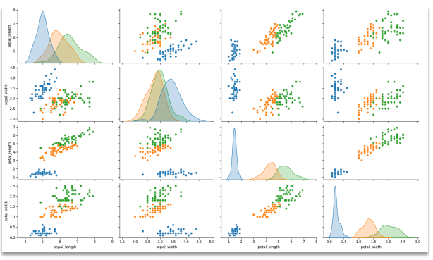
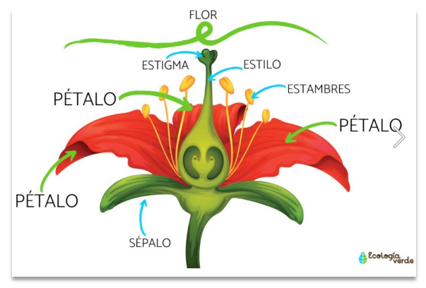

# [Índice](../README.md)
**1. Introducción a la Estadística Gráficos y Visualización de Datos**  
  - [Introducción estadística](../Estadistica/Introduccion_estadistica.md)
  - [Gráficos y Visualización de datos](../Estadistica/Graficos_Visualizacion_de_datos.md)

**2. Probabilidad**

**3. Distribuciones de Probabilidad**

**4. Correlación y Regresión**

**5. Métodos de Muestreo**

---

## Gráficas y Visualización de datos
### Importancia de la visualización de datos
- ¿Por qué es importante aprender a visualizar datos?
  - La visualización de datos juega un papel crucial tanto en el análisis de datos como en la inteligencia artificial (IA) por varias razones:
    - La visualización ayuda a explorar los datos y entender sus características principales.
      - Mediante gráficos, es posible identificar patrones, tendencias y relaciones entre variables.
    - Los fráficos facilitan la identificación de valores atípicos o anomalías que pueden afectar los resultados de los análisis.
    - Ejemplo de una tabla de datos:
  
      

    - Una gráfica nos representa mejor los datos:
      
      

#### ¿Qué es Seaborn?
- `Seaborn` es una **librería de visualización de datos en Python** que se basa en **Matplolib**.
- Proporciona una interfaz de alto nivel para dibujar **gráficos estadísticos atractivos y con estilo**.
- [Página oficial Seaborn](https://seaborn.pydata.org/)
- Seaborn facilita la visualización de datos al ofrecer funciones que permiten crear gráficos complejos con pocas líneas de código.

---

### Tipos de gráficos más comunes

- **Gráfico de dispersión**
  - ¿Qué representan?
    - Muestra la relación entre dos variables continuas mediante puntos en un plano cartesiano, X <-> Y
  - ¿Para qué se usan?
    - Se usa para identificar y analizar relaciones, patrones y tendencias entre dos variables.
  - ¿Qué conclusiones se pueden sacar?
    - Se pueden identificar correlaciones, patrones, tendencias y detectar valores atípicos.
  
    

---

- **Gráfico de barras**
  - ¿Qué representan?
    - Representan datos categóricos con barras rectangulares, donde la longitud de cada barra es proporcional al valor que representa.
  - ¿Para qué se usan?
    - Se usa para comparar diferentes categorías entre sí.
  - ¿Qué conclusiones se pueden sacar?
    - Permite ver fácilmente las diferencias y comparaciones entre categorías, así como identificar las categorías con valores más altos y más bajos.

    

---

- **Gráfico de cajas**
  - ¿Qué representan?
    - Rpresentan la distribución de una variable continua mostrando la mediana, los cuartiles y los valores atípicos.
  - ¿Para qué se usan?
    - Se usa para resumir la distribución de datos y detectar valores atípicos.
  - ¿Qué conclusiones se pueden sacar?
    - Se puede ver la mediana, la dispersión, la presencia de valores atípicos, y comparar la distribución entre diferentes grupos.

    

---

- **Gráfico de histograma**
  - ¿Qué representan?
    - Muestra la distribución de una variable continua dividiendo el rango de valores en intervalos y contando la frecuencia de los valores en cada intevalo.
  - ¿Para qué se usan?
    - Se usa para entender la distribución y frecuencia de una variable continua
  - ¿Qué conclusiones se pueden sacar?
    - Se puede identificar patrones de distribución, como la simetría, la asimetría, la presencia de múltiples picos(multimodalidad) y detectar valores atípicos.
  
    

---

- **Gráfico de violín**
  - ¿Qué representan?
    - Combina el blox plot con un gráfico de densidad para mostrar la distribución de una variable continua.
  - ¿Para qué se usan?
    - Se usa para visualizar la distribución y la densidad de una variable, comparando varias categorías o grupos.
  - ¿Qué conclusiones se pueden sacar?
    - Proporciona una visión más detallada de la distribución de los datos, permitiendo comparar la forma de la distribución entre diferentes grupos o categorías.
      
      

---

- **Gráfico de correlación(Heatmap)**
  - ¿Qué representan?
    - Muestra la relación entre múltiples variables en una matriz, donde los valores son representados con colores.
  - ¿Para qué se usan?  
    - Se usa para identificar y visualizar relaciones y patrones de correlación entre múltiples varibales.
  - ¿Qué conclusiones se pueden sacar?
    - Se puede ver qué variables están altamente correlacionadas positiva o negativamente, lo que es útil para la selección de características y la identificación de relaciones entre variables.
  
    

---

### Ejemplos prácticos en Seaborn

> [!IMPORTANT]  
> Es importante conocer los datos con los que vamos a trabajar.

- **Explicación de dataset - DATA SET IRIS**
  - Contiene 150 observaciones de iris (un tipo de flor) de tres especies diferentes:
    - Iris setosa
    - Iris versicolor
    - Iris virginica
  - Cada observación incluye cuatro características medidas de cada flor y la especie a la que pertenece.
  - **Columnas del dataset**
    - **Sepal Length (cm):** 
      - Longitud del sépalo en centímetros.
    - **Sepal Width (cm):** 
      - Ancho del sépalo en centímetros.
    - **Petal Length (cm):** 
      - Longitud del pétalo en centímetros.
    - **Petal Width (cm):** 
      - Ancho del pétalo en centímetros.
    - **Species:** 
      - Especie de la flor, que puede ser una de las tres:
        - setosa
        - versicolor
        - virginica
  
      

  - Librerías de Python utilizadas.
  
    ```bash
      pip install matplotlib
    ```

    ```bash
      pip install seaborn
    ```

  - [Código de ejemplo: Data set IRIS](../Estadistica/seaborn_data_set_iris.py)


### Buenas prácticas de visualización


